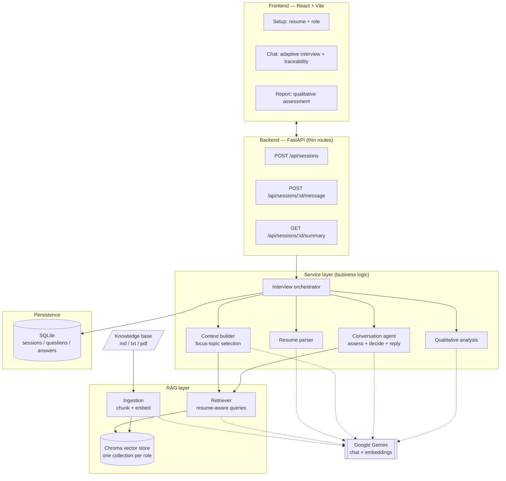

# AI Interview Screening System

An AI-powered, **role-based candidate screening system**. A candidate uploads a
resume and picks a target role, then has a **live, conversational interview** with
"Ava", an adaptive interviewer. The system parses the resume, decides what to
evaluate, retrieves grounded material from a **role-specific knowledge base
(RAG)**, and generates each turn **dynamically** — influenced by the role, the
candidate's background, and the conversation so far. It ends with a **qualitative
assessment**.

> Questions are never predefined. Ava reads each answer and *decides* the next
> move: a strong answer earns a quick compliment and a new topic; a weak or
> confused one triggers a targeted **follow-up** that probes the gap. Every turn
> is grounded in retrieved knowledge and stored with the exact context that
> produced it (full traceability).

---

## Table of contents
- [Key features](#key-features)
- [Architecture](#architecture)
- [The RAG interview pipeline](#the-rag-interview-pipeline)
- [Tech stack & why](#tech-stack--why)
- [Project structure](#project-structure)
- [Setup](#setup)
- [API reference](#api-reference)
- [Key design decisions](#key-design-decisions)
- [Knowledge base (and using the real textbooks)](#knowledge-base)
- [Testing](#testing)
- [Creative extensions](#creative-extensions)
- [Demo video](#demo-video)

---

## Key features

- **Conversational, adaptive interview.** A real chatbot flow: Ava assesses each
  answer live and either compliments + advances, or asks a pointed **follow-up**
  on a weakness/confusion (capped so a session always ends).
- **Resume-aware.** The resume drives topic selection, difficulty, and the
  direction of the conversation — not just cosmetic mentions.
- **RAG-grounded.** Every turn is grounded in a role-specific corpus (one Chroma
  collection per role), avoiding generic, hallucinated prompts.
- **Full traceability.** Each question persists its retrieval query and the exact
  knowledge-base chunks (with similarity scores) that produced it.
- **Qualitative final assessment.** Instead of a bare number, the session ends
  with a rating band (*Needs Work → Developing → Satisfactory → Strong →
  Exceptional*), per-topic ratings, strengths, gaps and a narrative — all
  evidence-based.
- **Resilient to free-tier limits.** Model calls parse JSON defensively, back off
  on rate limits, and **roll over to fallback models** when one hits its daily cap.
- **Clean, modular architecture.** Thin API layer, dedicated service layer, RAG
  package, relational persistence — configured entirely via environment variables.
- **Runs out of the box.** Ships with an original, concept-accurate knowledge base
  so the whole pipeline works without redistributing copyrighted books.

---

## Architecture



**Separation of concerns**
- **Routes** (`app/api/routes.py`) only validate input and shape responses.
- **Services** (`app/services/*`) hold all business logic and own persistence.
- **RAG** (`app/rag/*`) is a self-contained ingestion + retrieval package.
- **Models/DB** (`app/models.py`, `app/db/*`) define the relational schema.
- **Config** (`app/config.py`) centralises every tunable as an env var.

---

## The RAG interview pipeline

The system implements the required flow as an explicit, traceable pipeline:

1. **Knowledge ingestion** *(offline, once per corpus change)*
   Load role docs → `RecursiveCharacterTextSplitter` (size 1000 / overlap 150,
   split on markdown/paragraph boundaries) → Gemini embeddings → persist to a
   per-role **Chroma** collection with `source` + `topic` metadata.

2. **Resume processing** — extract text (PDF via `pypdf`) → LLM structures it into
   `{skills, technologies, domains, seniority, summary}` (with a deterministic
   keyword fallback).

3. **Context construction** — an LLM selects **focus topics** at the intersection
   of the role's knowledge base and the candidate's background (e.g. a candidate
   strong in PostgreSQL gets *"database indexing in PostgreSQL"*).

4. **Knowledge retrieval** — for each topic we build a **resume-aware query**
   (role + topic + candidate skills/tech) and fetch the top-k grounded chunks with
   relevance scores.

5. **Conversational turn (adaptive)** — for each candidate answer, the interviewer
   agent (`services/conversation.py`) sees the retrieved context + full history and
   returns structured control data: an **assessment** of the answer
   (strong/good/partial/weak/confused/off-topic), an **action**
   (`advance` / `follow_up` / `conclude`), and the natural chat **reply**. A strong
   answer advances to the next topic; a weak/confused one is probed with a
   follow-up (capped per topic). The reply + its grounding chunks are persisted.

6. **Final output** — a holistic, **qualitative** assessment: an overall rating
   band, per-topic ratings, strengths, areas to improve, a narrative, and the full
   traceable transcript.

`Context → Question → Answer → Storage` is preserved end to end.

---

## Tech stack & why

| Layer | Choice | Why |
|---|---|---|
| Frontend | **React + Vite** | Fast dev loop; clear component-per-stage state machine. |
| Backend | **FastAPI** | Async, typed, Pydantic validation, auto OpenAPI docs. |
| LLM + embeddings | **Google Gemini** (`gemini-flash-latest` + fallbacks, `gemini-embedding-001`) | Strong quality/latency for a live chat; unified provider; auto model-rollover on rate limits. |
| Vector store | **Chroma** (persistent) | Local, zero-infra, per-role collections, metadata + scored retrieval. |
| Relational store | **SQLite + SQLAlchemy 2.0** | Zero-config persistence; swap `DATABASE_URL` for Postgres in prod. |
| Chunking | **LangChain text splitters** | Context-preserving recursive splitting with overlap. |

---

## Project structure

```
ai-interview-screening/
├── backend/
│   ├── app/
│   │   ├── main.py                # FastAPI app + lifespan (init DB, validate env)
│   │   ├── config.py              # all settings from env vars
│   │   ├── models.py              # Session / Question / Answer (+ traceability)
│   │   ├── schemas.py             # Pydantic request/response contracts
│   │   ├── api/routes.py          # thin HTTP layer
│   │   ├── db/database.py         # SQLAlchemy engine/session
│   │   ├── rag/
│   │   │   ├── ingest.py          # load → chunk → embed → persist
│   │   │   ├── retriever.py       # resume-aware query building + retrieval
│   │   │   └── vectorstore.py     # per-role Chroma collections
│   │   └── services/
│   │       ├── llm.py             # Gemini chat/embeddings + JSON parsing + model fallback
│   │       ├── resume_parser.py   # PDF text + LLM profile extraction
│   │       ├── context_builder.py # focus-topic selection (the coverage plan)
│   │       ├── conversation.py    # adaptive interviewer agent (assess + decide + reply)
│   │       ├── analysis.py        # qualitative holistic assessment
│   │       ├── interview.py       # orchestration + persistence
│   │       └── roles.py           # role registry
│   ├── knowledge_base/            # role corpora (md/txt/pdf)
│   ├── scripts/ingest_kb.py       # CLI to build the vector store
│   ├── tests/test_units.py        # offline unit tests
│   ├── requirements.txt
│   ├── Dockerfile
│   └── .env.example
├── frontend/
│   ├── src/
│   │   ├── App.jsx                # stage state machine (setup → chat → report)
│   │   ├── api.js                 # backend client
│   │   ├── hooks/useTypewriter.js # live "typing" reveal for Ava's messages
│   │   └── components/            # Setup / Chat / Message / Summary
│   ├── vite.config.js             # dev proxy to backend
│   └── Dockerfile
├── docker-compose.yml
├── run_dev.sh                     # one-command local dev
└── README.md
```

---

## Setup

### Prerequisites
- Python 3.11+ and Node 18+
- A **Google Gemini API key** (`GEMINI_API_KEY`)

### Option A — one command (local)
```bash
cd ai-interview-screening
cp backend/.env.example backend/.env      # then edit and add GEMINI_API_KEY
./run_dev.sh
```
Frontend: http://localhost:5173 · Backend docs: http://127.0.0.1:8000/docs

### Option B — manual
```bash
# 1) Backend
cd backend
python3 -m venv .venv && source .venv/bin/activate
pip install -r requirements.txt
cp .env.example .env                       # add GEMINI_API_KEY
python -m scripts.ingest_kb                # build the vector store
uvicorn app.main:app --reload              # http://127.0.0.1:8000

# 2) Frontend (new terminal)
cd frontend
npm install
npm run dev                                # http://localhost:5173
```

### Option C — Docker
```bash
export GEMINI_API_KEY=your_key
docker compose up --build
```
Frontend: http://localhost:8080 · Backend: http://localhost:8000

---

## API reference

Base URL: `http://127.0.0.1:8000` · Interactive docs at `/docs`.

| Method | Endpoint | Purpose |
|---|---|---|
| `GET` | `/health` | Liveness + active model. |
| `GET` | `/api/roles` | List selectable roles. |
| `POST` | `/api/sessions` | Start a session. Multipart: `role`, `candidate_name`, and `resume_file` (PDF/txt) **or** `resume_text`. Returns profile, focus topics, and Ava's **opening message**. |
| `POST` | `/api/sessions/{id}/message` | One conversational turn. Body `{text}` (the candidate's answer). Returns `{reply, done}`. |
| `GET` | `/api/sessions/{id}/summary` | Final qualitative assessment + full transcript. |

Endpoints map to the conversation lifecycle; validation errors return clear
`4xx` with a JSON `detail`. Turns are stateful on the server (the session tracks
plan position + follow-up depth), so the client only ever posts the latest answer.

---

## Key design decisions

- **One Chroma collection per role.** Retrieval is naturally scoped — a Backend
  interview can never pull Data-Science context. Adding a role = adding a folder.
- **Resume-aware retrieval queries.** Instead of a generic "role questions" query,
  each query fuses role + topic + the candidate's own skills, so the *retrieved
  context itself* is personalised before generation even happens.
- **Adaptive turns over fixed questions.** The interviewer decides `advance` vs
  `follow_up` vs `conclude` from a live assessment of each answer — with hard caps
  (max questions, max follow-ups per topic) so a session always terminates.
- **Traceability is first-class.** `retrieval_query` and `context_sources` are
  columns on `questions`, not logs. You can always answer "why was this asked?".
- **Qualitative evaluation.** The finale reports a rating *band* + per-topic
  ratings (an internal numeric average backs the fallback), which reads more like
  a human panel than a bare score.
- **LLM resilience.** Model calls parse JSON defensively (code-fence/prose
  tolerant), back off on 429s, and **roll over to fallback models** on daily-cap
  exhaustion; deterministic fallbacks mean a bad response never breaks the chat.
- **Config over code.** Models + fallbacks, chunking, `k`, question caps, DB URL,
  CORS — all env vars, so the same code runs locally, in Docker, or against Postgres.
- **Thin routes, fat services.** Business logic and persistence live in the
  service layer; routes stay trivial and testable.

---

## Knowledge base

Each `backend/knowledge_base/<role>/` folder is one corpus → one vector-store
collection. The bundled `.md` files are **original, concept-accurate notes**
written for this project, so the RAG pipeline is fully runnable without
redistributing copyrighted textbooks.

**Using the assignment's recommended books instead** — the pipeline ingests
`.pdf`, `.md`, and `.txt` transparently. Drop a book PDF into the relevant role
folder and re-ingest; no code changes:
```bash
cp "The-Hundred-Page-Machine-Learning-Book.pdf" backend/knowledge_base/ai_ml_engineer/
cd backend && python -m scripts.ingest_kb ai_ml_engineer
```

---

## Testing

```bash
cd backend && python -m pytest -q      # offline unit tests (no API key needed)
```
Covers JSON extraction, resume-aware query construction, the role registry, and
profile normalisation/fallback. The full conversational flow (adaptive
follow-ups, compliments, conclusion, qualitative report) was additionally
validated end-to-end against the running API and in the browser with a real resume.

---

## Creative extensions

Beyond the baseline, this build adds: a **conversational, adaptive interviewer**
("Ava") that probes weaknesses and compliments strong answers; a **qualitative
rating band** + per-topic ratings instead of a bare score; **resume-aware
retrieval queries** (personalising the *context*, not just the prompt);
**difficulty scaled to inferred seniority**; **visible retrieval traceability**;
**role-scoped vector collections**; and **automatic model rollover** so a free-tier
daily cap on one model doesn't break the session.

---

## A note on Gemini free-tier limits

Gemini's free tier caps requests **per model, per day**. One full interview is
~9–12 model calls, so heavy testing can exhaust a model's daily quota — you'll see
turns slow down or the final report fall back to *"rating derived from live
assessments"*. Mitigations built in: automatic **fallback models** (`LLM_FALLBACKS`)
and tunable **`MAX_QUESTIONS`**. For a smooth demo, use an API key with billing
enabled, or record after the daily quota resets.

---

## Demo video

A short walkthrough demonstrates the complete flow end-to-end: resume upload →
role selection → the **live adaptive chat** (compliments, follow-ups, visible
retrieved context) → the **qualitative assessment** report. See
[`DEMO_SCRIPT.md`](DEMO_SCRIPT.md) for a timed, side-by-side shot list.

> _Add the recorded demo link here._
```
Demo video: <link>
```
