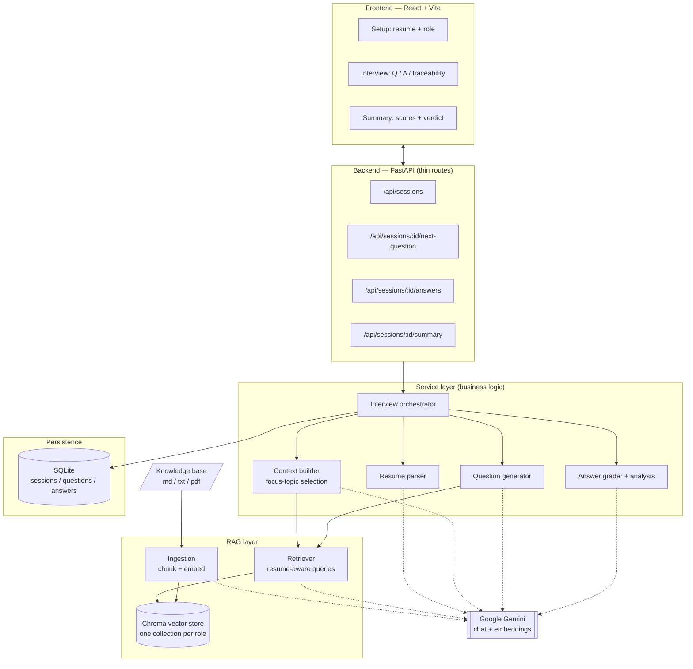

# AI Interview Screening System

An AI-powered, **role-based candidate screening system**. A candidate uploads a
resume and picks a target role; the system parses the resume, decides what to
evaluate, retrieves grounded material from a **role-specific knowledge base
(RAG)**, and runs a structured technical interview whose questions are
**dynamically generated** — influenced by both the role and the candidate's own
background. Every answer is graded and the session ends with a structured
assessment.

> Questions are never predefined. They are produced live from
> `resume → focus topics → retrieved knowledge → generated question`, and each
> question stores the exact context that produced it (full traceability).

---

## Table of contents
- [Key features](#key-features)
- [Architecture](#architecture)
- [The RAG interview pipeline](#the-rag-interview-pipeline)
- [Tech stack & why](#tech-stack--why)
- [Project structure](#project-structure)
- [Setup](#setup)
- [API reference](#api-reference)
- [Key design decisions](#key-design-decisions)
- [Knowledge base (and using the real textbooks)](#knowledge-base)
- [Testing](#testing)
- [Creative extensions](#creative-extensions)
- [Demo video](#demo-video)

---

## Key features

- **Resume-aware interviews.** The resume meaningfully drives topic selection,
  question difficulty, and interview direction — not just cosmetic mentions.
- **RAG-grounded question generation.** Questions are grounded in a role-specific
  corpus (one Chroma collection per role), avoiding generic, hallucinated prompts.
- **Full traceability.** Each question persists its retrieval query and the exact
  knowledge-base chunks (with similarity scores) that produced it. The UI surfaces
  this under every question.
- **Adaptive question flow.** Each new question is aware of previous Q&A and can
  probe deeper on weak areas.
- **Automatic grading + final assessment.** Every answer gets a 0–10 score and
  feedback grounded in the same context; the session produces a verdict,
  strengths, gaps, and a narrative.
- **Clean, modular architecture.** Thin API layer, dedicated service layer, RAG
  package, relational persistence — configured entirely via environment variables.
- **Runs out of the box.** Ships with an original, concept-accurate knowledge base
  so the whole pipeline works without redistributing copyrighted books.

---

## Architecture



**Separation of concerns**
- **Routes** (`app/api/routes.py`) only validate input and shape responses.
- **Services** (`app/services/*`) hold all business logic and own persistence.
- **RAG** (`app/rag/*`) is a self-contained ingestion + retrieval package.
- **Models/DB** (`app/models.py`, `app/db/*`) define the relational schema.
- **Config** (`app/config.py`) centralises every tunable as an env var.

---

## The RAG interview pipeline

The system implements the required flow as an explicit, traceable pipeline:

1. **Knowledge ingestion** *(offline, once per corpus change)*
   Load role docs → `RecursiveCharacterTextSplitter` (size 1000 / overlap 150,
   split on markdown/paragraph boundaries) → Gemini embeddings → persist to a
   per-role **Chroma** collection with `source` + `topic` metadata.

2. **Resume processing** — extract text (PDF via `pypdf`) → LLM structures it into
   `{skills, technologies, domains, seniority, summary}` (with a deterministic
   keyword fallback).

3. **Context construction** — an LLM selects **focus topics** at the intersection
   of the role's knowledge base and the candidate's background (e.g. a candidate
   strong in PostgreSQL gets *"database indexing in PostgreSQL"*).

4. **Knowledge retrieval** — for each topic we build a **resume-aware query**
   (role + topic + candidate skills/tech) and fetch the top-k grounded chunks with
   relevance scores.

5. **Question generation** — the LLM writes one question grounded in the retrieved
   chunks, tailored to the candidate, aware of prior Q&A, at difficulty scaled to
   seniority. The retrieval query + chunks are persisted with the question.

6. **Response handling** — answers are stored and graded (0–10 + feedback) against
   the same context.

7. **Final output** — an aggregated, structured summary: overall score, verdict,
   strengths, areas to improve, narrative, and the full traceable transcript.

`Context → Question → Answer → Storage` is preserved end to end.

---

## Tech stack & why

| Layer | Choice | Why |
|---|---|---|
| Frontend | **React + Vite** | Fast dev loop; clear component-per-stage state machine. |
| Backend | **FastAPI** | Async, typed, Pydantic validation, auto OpenAPI docs. |
| LLM + embeddings | **Google Gemini** (`gemini-2.5-flash`, `gemini-embedding-001`) | Strong quality/latency for generation + grading; unified provider. |
| Vector store | **Chroma** (persistent) | Local, zero-infra, per-role collections, metadata + scored retrieval. |
| Relational store | **SQLite + SQLAlchemy 2.0** | Zero-config persistence; swap `DATABASE_URL` for Postgres in prod. |
| Chunking | **LangChain text splitters** | Context-preserving recursive splitting with overlap. |

---

## Project structure

```
ai-interview-screening/
├── backend/
│   ├── app/
│   │   ├── main.py                # FastAPI app + lifespan (init DB, validate env)
│   │   ├── config.py              # all settings from env vars
│   │   ├── models.py              # Session / Question / Answer (+ traceability)
│   │   ├── schemas.py             # Pydantic request/response contracts
│   │   ├── api/routes.py          # thin HTTP layer
│   │   ├── db/database.py         # SQLAlchemy engine/session
│   │   ├── rag/
│   │   │   ├── ingest.py          # load → chunk → embed → persist
│   │   │   ├── retriever.py       # resume-aware query building + retrieval
│   │   │   └── vectorstore.py     # per-role Chroma collections
│   │   └── services/
│   │       ├── llm.py             # Gemini chat/embeddings + robust JSON parsing
│   │       ├── resume_parser.py   # PDF text + LLM profile extraction
│   │       ├── context_builder.py # focus-topic selection
│   │       ├── question_gen.py    # grounded question generation
│   │       ├── analysis.py        # answer grading + final summary
│   │       ├── interview.py       # orchestration + persistence
│   │       └── roles.py           # role registry
│   ├── knowledge_base/            # role corpora (md/txt/pdf)
│   ├── scripts/ingest_kb.py       # CLI to build the vector store
│   ├── tests/test_units.py        # offline unit tests
│   ├── requirements.txt
│   ├── Dockerfile
│   └── .env.example
├── frontend/
│   ├── src/
│   │   ├── App.jsx                # stage state machine
│   │   ├── api.js                 # backend client
│   │   └── components/            # Setup / Interview / Summary / Profile / Stepper
│   ├── vite.config.js             # dev proxy to backend
│   └── Dockerfile
├── docker-compose.yml
├── run_dev.sh                     # one-command local dev
└── README.md
```

---

## Setup

### Prerequisites
- Python 3.11+ and Node 18+
- A **Google Gemini API key** (`GEMINI_API_KEY`)

### Option A — one command (local)
```bash
cd ai-interview-screening
cp backend/.env.example backend/.env      # then edit and add GEMINI_API_KEY
./run_dev.sh
```
Frontend: http://localhost:5173 · Backend docs: http://127.0.0.1:8000/docs

### Option B — manual
```bash
# 1) Backend
cd backend
python3 -m venv .venv && source .venv/bin/activate
pip install -r requirements.txt
cp .env.example .env                       # add GEMINI_API_KEY
python -m scripts.ingest_kb                # build the vector store
uvicorn app.main:app --reload              # http://127.0.0.1:8000

# 2) Frontend (new terminal)
cd frontend
npm install
npm run dev                                # http://localhost:5173
```

### Option C — Docker
```bash
export GEMINI_API_KEY=your_key
docker compose up --build
```
Frontend: http://localhost:8080 · Backend: http://localhost:8000

---

## API reference

Base URL: `http://127.0.0.1:8000` · Interactive docs at `/docs`.

| Method | Endpoint | Purpose |
|---|---|---|
| `GET` | `/health` | Liveness + active model. |
| `GET` | `/api/roles` | List selectable roles. |
| `POST` | `/api/sessions` | Start a session. Multipart: `role`, `candidate_name`, and `resume_file` (PDF/txt) **or** `resume_text`. Returns profile + focus topics. |
| `GET` | `/api/sessions/{id}/next-question` | Generate/return the next question (with retrieved context). `finished` when done. |
| `POST` | `/api/sessions/{id}/answers` | Submit `{question_id, answer}`; returns score + feedback. |
| `GET` | `/api/sessions/{id}/summary` | Final structured assessment + full transcript. |

Endpoints map 1:1 to the interview lifecycle; validation errors return clear
`4xx` with a JSON `detail`, and the service layer is idempotent (re-fetching a
question or re-submitting an answer is safe).

---

## Key design decisions

- **One Chroma collection per role.** Retrieval is naturally scoped — a Backend
  interview can never pull Data-Science context. Adding a role = adding a folder.
- **Resume-aware retrieval queries.** Instead of a generic "role questions" query,
  each query fuses role + topic + the candidate's own skills, so the *retrieved
  context itself* is personalised before generation even happens.
- **Traceability is first-class.** `retrieval_query` and `context_sources` are
  columns on `questions`, not logs. You can always answer "why was this asked?".
- **Grounded grading.** Answers are scored against the same chunks that generated
  the question, keeping questions and evaluation consistent.
- **LLM resilience.** All model calls parse JSON defensively (code-fence/prose
  tolerant) and have deterministic fallbacks, so a single bad response never
  breaks the interview.
- **Config over code.** Models, chunking, `k`, question count, DB URL, CORS — all
  env vars, so the same code runs locally, in Docker, or against Postgres.
- **Thin routes, fat services.** Business logic and persistence live in the
  service layer; routes stay trivial and testable.

---

## Knowledge base

Each `backend/knowledge_base/<role>/` folder is one corpus → one vector-store
collection. The bundled `.md` files are **original, concept-accurate notes**
written for this project, so the RAG pipeline is fully runnable without
redistributing copyrighted textbooks.

**Using the assignment's recommended books instead** — the pipeline ingests
`.pdf`, `.md`, and `.txt` transparently. Drop a book PDF into the relevant role
folder and re-ingest; no code changes:
```bash
cp "The-Hundred-Page-Machine-Learning-Book.pdf" backend/knowledge_base/ai_ml_engineer/
cd backend && python -m scripts.ingest_kb ai_ml_engineer
```

---

## Testing

```bash
cd backend && python -m pytest -q      # offline unit tests (no API key needed)
```
Covers JSON extraction, resume-aware query construction, the role registry, and
profile normalisation/fallback. The full pipeline was additionally validated
end-to-end against the running API with a real resume.

---

## Creative extensions

Beyond the baseline, this build adds: **automatic per-answer grading with
feedback**, a **final verdict + strengths/gaps assessment**, **visible retrieval
traceability** per question, **resume-aware retrieval queries** (personalising the
context, not just the prompt), **difficulty scaled to inferred seniority**,
**adaptive follow-ups** using conversation history, and **role-scoped vector
collections** for clean multi-role support.

---

## Demo video

A short walkthrough demonstrates the complete flow end-to-end: resume upload →
role selection → parsed profile & chosen focus topics → grounded questions with
visible retrieved context → answering and live grading → final structured summary.

> _Add the recorded demo link here._
```
Demo video: <link>
```
